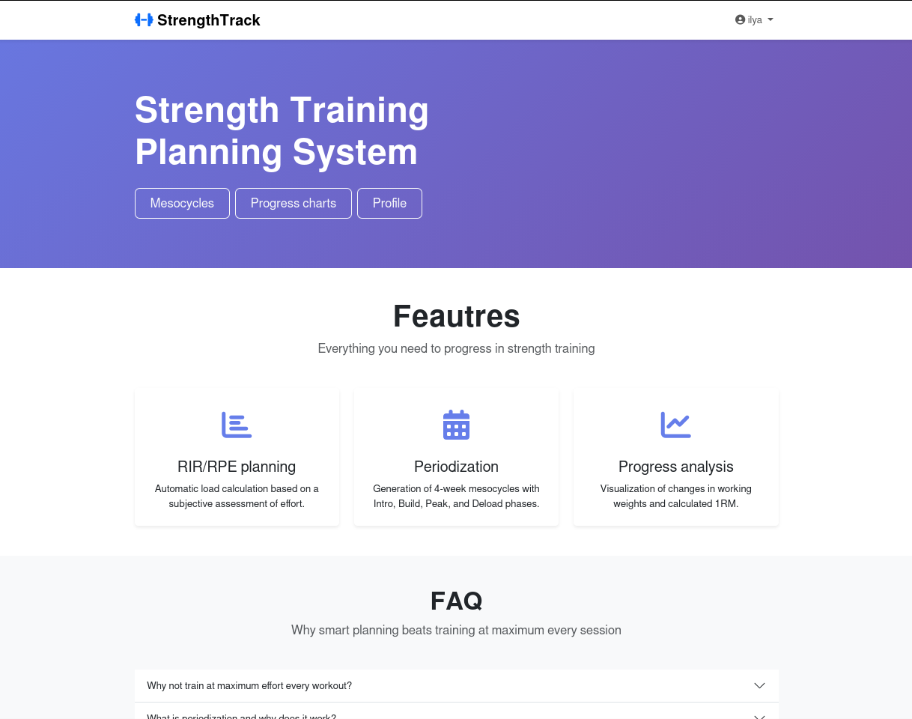
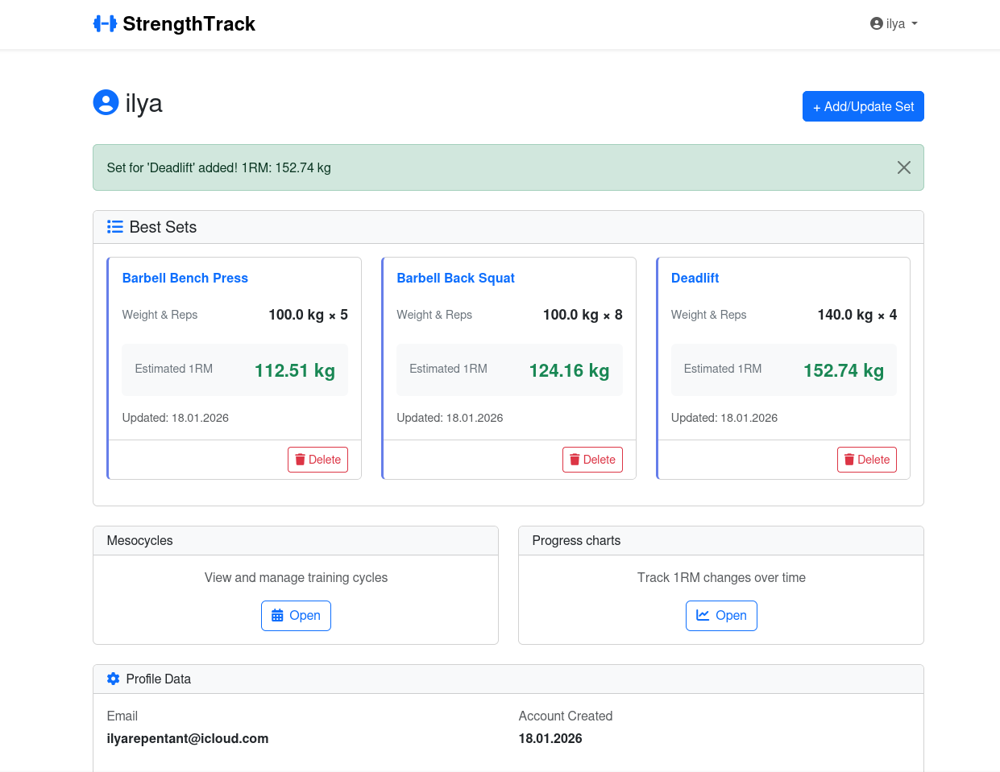
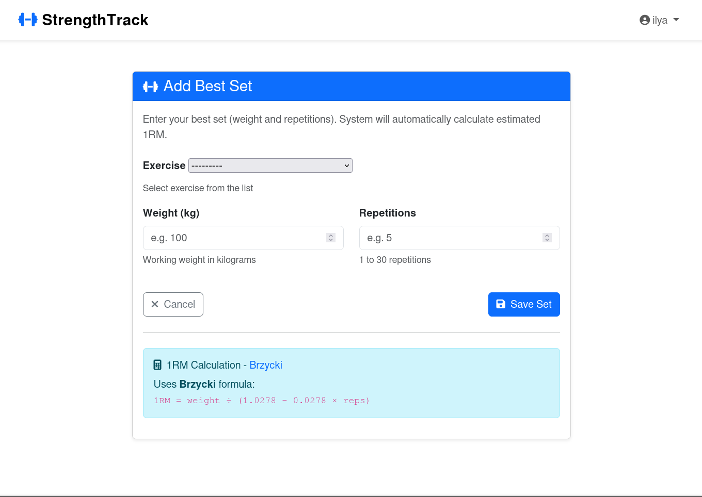
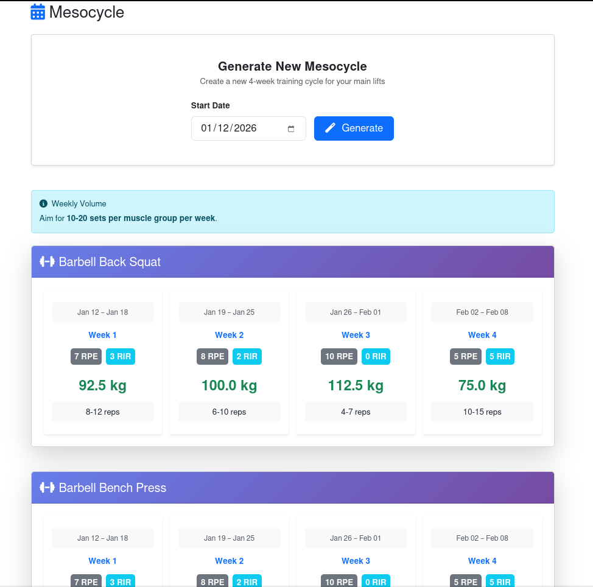
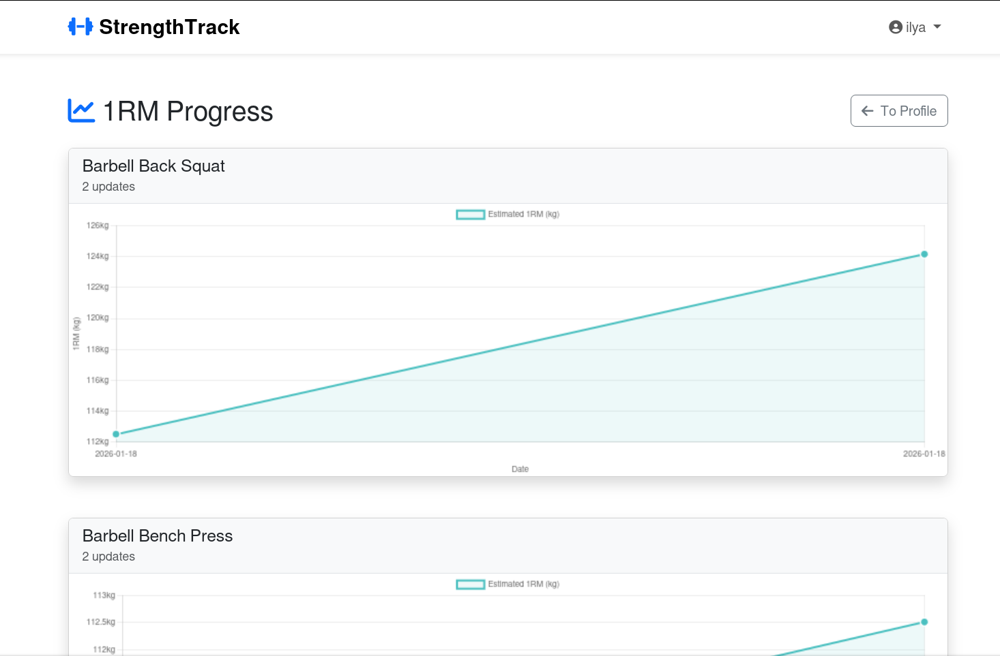

# StrengthTrack

Добро пожаловать в **StrengthTrack** — комплексное решение для отслеживания прогресса в силовых тренировках, управления личными рекордами и генерации структурированных мезоциклов.

---

## Локальная установка

Следуйте этим шагам для установки StrengthTrack на ваш компьютер:

### 1. Клонируйте репозиторий

```bash
git clone https://github.com/repen7ant/StrengthTrack.git
cd StrengthTrack
```

### 2. Создайте и активируйте виртуальное окружение

```bash
python -m venv venv
# На Unix/Linux/macOS:
source venv/bin/activate
# На Windows:
venv\Scripts\activate
```

### 3. Установите зависимости

```bash
pip install -r requirements.txt
```

### 4. Настройте переменные окружения

Создайте файл `.env` в корневой директории проекта и укажите ваши параметры:
```env
DJANGO_SECRET_KEY=your_secret_key_here
DEBUG=False
```

### 5. Примените миграции

```bash
python manage.py makemigrations
python manage.py migrate
```

### 6. Заполните упражнения

Эта команда добавит первоначальный список упражнений:

```bash
python manage.py populate_exercises
```

### 7. Запустите сервер

```bash
python manage.py runserver
```

Перейдите по адресу http://127.0.0.1:8000/ для доступа к приложению в браузере.

---

## Скриншоты


*Главная страница после запуска сервера*


*Профиль пользователя с лучшими подходами*


*Форма добавления или редактирования личных рекордов*


*Сгенерированный 4-недельный мезоцикл на основе рекордов*


*Прогресс по 1ПМ со временем, отдельные графики по каждому упражнению*

---

## Архитектура

**StrengthTrack** построен на Django с модульной, предметно-ориентированной архитектурой:

### Основные компоненты

- **Пользователи и профили:**  
  Модель `UserProfile` расширяет стандартного пользователя Django, создавая профиль для тренировочных данных.

- **Упражнения:**  
  Модель `Exercise` содержит каталог названий упражнений/лифтов.

- **BestSet:**  
  Модель `BestSet` хранит лучший результат пользователя (вес × повторения) по каждому упражнению, автоматически вычисляя 1ПМ по формуле Бжицкого:
  ```
  1ПМ = вес / (1,0278 - 0,0278 * повторения)
  ```
  Все предыдущие рекорды хранятся в `BestSetHistory`.
  
- **Мезоциклы:**  
  Модель `Mesocycle` организует структурированные 4-недельные тренировочные блоки, автогенерируемые по основным упражнениям и рекордам, с периодизацией интенсивности (RPE, повторения, прогрессия веса).

- **Сервисы:**  
  Вся бизнес-логика находится в слое `services/` (например, `BestSetService`, `MesocycleService`, `ProfileService`, `ProgressService`):  
  - `BestSetService`: добавляет, обновляет, удаляет рекорды, проверяет корректность и ведёт историю.
  - `MesocycleService`: генерирует и получает мезоциклы для пользователя, группирует результаты, учитывает правильное округление веса.
  - `ProfileService`: получает рекорды для профилей.
  - `ProgressService`: формирует данные по прогрессу 1ПМ для графиков.

- **Формы:**  
  - Регистрация и обновление профиля (`UserRegisterForm`, `UserUpdateForm`)
  - Ввод и проверка рекордов (`BestSetForm`)
  - Все формы используют `django-crispy-forms` для красивого оформления через Bootstrap.

- **Представления (views):**  
  Django-функции обрабатывают отображение, работу с формами, авторизацию и обращение к сервисам:
    - `/` — Главная страница (`core/views.py`)
    - `/accounts/profile/` — Профиль с рекордами и их редактированием
    - `/accounts/mesocycle/` — Создание и список мезоциклов
    - `/accounts/progress/` — Графики прогресса по всем упражнениям
    - Пути авторизации: вход, регистрация

- **Шаблоны:**  
  - Хранятся в `core/templates/core` и `core/templates/accounts`
  - Есть для регистрации, входа, основных экранов, форм, списков, всплывающих окон и графиков.

---

### Поток данных

1. **Пользователь регистрируется или входит**
2. **Добавляет свои рекорды** (вес, повторения, упражнение) через формы
   - Текущее значение обновляется только если новый рекорд лучше (по 1ПМ)
   - Старые рекорды записываются в историю
3. **Генерирует мезоциклы**
   - Система заранее подгружает основные упражнения с штангой
   - Создаётся 4-недельный блок с периодизированной интенсивностью/повторениями/весом
4. **Видит весь прогресс по рекордам**
   - 1ПМ и его изменения отображаются на графиках

---

### Стек технологий

- Django (бэкенд)
- SQLite (база данных)
- Crispy Forms и Bootstrap (оформление форм и фронтенда)
- HTML-шаблоны
- Chart.js для построения графиков прогресса

---

## Вопросы и примечания

- Для входа в админ-панель Django:  
  `python manage.py createsuperuser`
- **Не добавляйте** `.env` �� секретные ключи в систему контроля версий!
- Чтобы загрузить больше упражнений при старте, отредактируйте `core/management/commands/populate_exercises.py`.